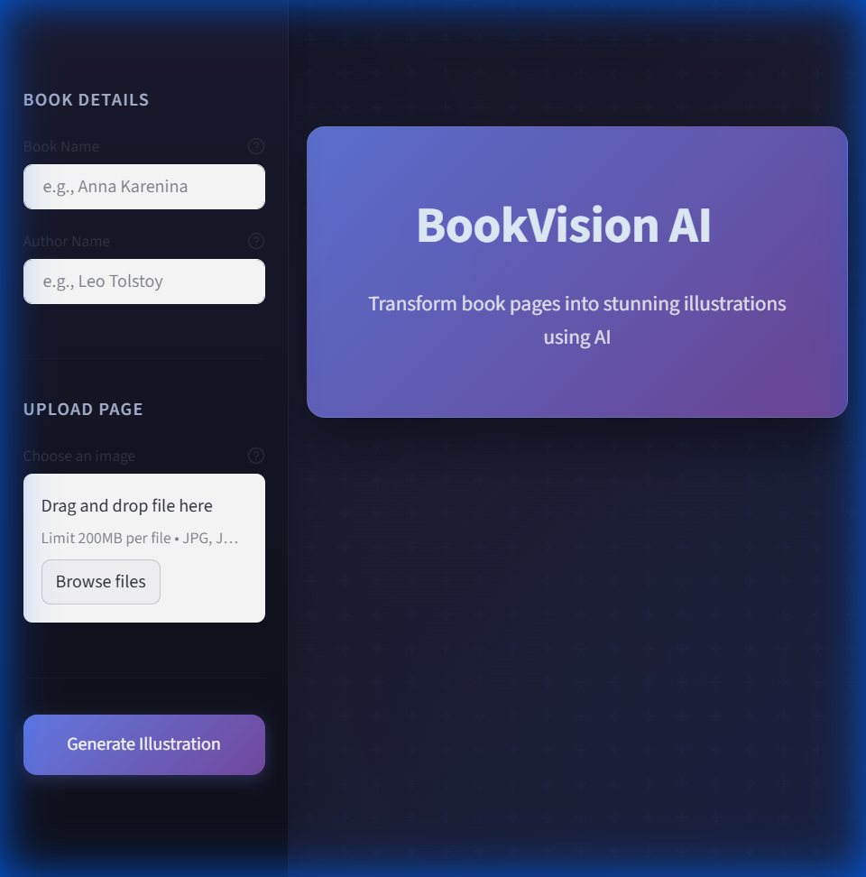

# BookVision AI

**A multimodal AI agent with OCR confidence tracking, LLM-based faithfulness evaluation, and failure-aware orchestration for grounded image generation.**

BookVision transforms book pages into thematic illustrations by combining optical character recognition, external knowledge retrieval, large language model analysis, and diffusion-based image synthesis. The system maintains grounding through confidence metrics at each stage, ensuring generated illustrations remain faithful to the source text.

---

## Preview




---

## Table of Contents

- [Preview](#preview)
- [Key Features](#key-features)
- [Architecture Overview](#architecture-overview)
- [Technology Stack](#technology-stack)
- [Project Structure](#project-structure)
- [Component Documentation](#component-documentation)
  - [OCR Module](#1-ocr-module-toolsocrpy)
  - [Book Context Module](#2-book-context-module-toolsweb_searchpy)
  - [Summarizer Module](#3-summarizer-module-toolssummarizerpy)
  - [Evaluation Module](#4-evaluation-module-evaluationevaluationpy)
  - [Prompt Generator](#5-prompt-generator-toolsprompt_generatorpy)
  - [Image Generator](#6-image-generator-toolsimage_genpy)
- [Installation](#installation)
- [Usage](#usage)
- [API Reference](#api-reference)
- [Configuration](#configuration)
- [Dependencies](#dependencies)

---

## Key Features

- **Multimodal Input Processing**: Accepts book page images and extracts text using confidence-scored OCR
- **External Knowledge Augmentation**: Enriches context with book metadata (author, era, genre) from Open Library API
- **Structured Scene Analysis**: LLM-powered extraction of visual elements, characters, settings, and mood
- **Faithfulness Evaluation**: Automated quality scoring with hallucination detection before image generation
- **Era-Aware Prompt Engineering**: Dynamic style mapping based on publication period for historically appropriate illustrations
- **Failure-Aware Orchestration**: Graceful fallbacks at each pipeline stage with confidence tracking

---

## Architecture Overview

```
┌─────────────────────────────────────────────────────────────────────────────┐
│                              BOOKVISION PIPELINE                            │
├─────────────────────────────────────────────────────────────────────────────┤
│                                                                             │
│   ┌──────────────┐     ┌──────────────┐     ┌──────────────────────────┐   │
│   │   Frontend   │────▶│   Backend    │────▶│      Processing Pipeline │   │
│   │  (Streamlit) │     │  (FastAPI)   │     │                          │   │
│   └──────────────┘     └──────────────┘     │  1. OCR Extraction       │   │
│                                              │  2. Book Context Lookup  │   │
│                                              │  3. Page Summarization   │   │
│                                              │  4. Quality Evaluation   │   │
│                                              │  5. Prompt Generation    │   │
│                                              │  6. Image Generation     │   │
│                                              └──────────────────────────┘   │
│                                                                             │
└─────────────────────────────────────────────────────────────────────────────┘
```

### Data Flow

```
┌─────────────┐    ┌─────────────┐    ┌─────────────┐    ┌─────────────┐
│  Book Page  │───▶│   OCR       │───▶│  Summarizer │───▶│  Prompt     │
│   Image     │    │  (Tesseract)│    │  (Zephyr-7B)│    │  Generator  │
└─────────────┘    └─────────────┘    └─────────────┘    └──────┬──────┘
                          │                   │                  │
                          ▼                   ▼                  │
                   [Confidence: 0.87]  [Faithfulness: 4/5]       │
                                       [Hallucination: No]       │
                                                                 │
      ┌─────────────┐                                            │
      │ Open Library│───────────────────────────────────────────▶│
      │   API       │       (Book Context: Era, Genre, Author)   │
      └─────────────┘                                            │
                                                                 ▼
                   ┌─────────────┐    ┌─────────────────────────────┐
                   │  Generated  │◀───│  Stable Diffusion XL        │
                   │ Illustration│    │  (Text-to-Image Generation) │
                   └─────────────┘    └─────────────────────────────┘
```

---

## Technology Stack

| Layer | Technology | Purpose |
|-------|------------|---------|
| Frontend | Streamlit | Interactive web interface for image upload and result display |
| Backend | FastAPI + Uvicorn | Async REST API server handling pipeline orchestration |
| OCR | Tesseract + OpenCV | Text extraction from book page images with confidence scoring |
| Book Metadata | Open Library API | Retrieves author, genre, era, and book descriptions |
| Summarization | Google Gemma-2-2B | Extracts visual elements and narrative from text |
| Evaluation | Google Gemma-2-2B | Scores summary faithfulness, detects hallucinations |
| Prompt Engineering | Google Gemma-2-2B | Refines scene descriptions into era-appropriate prompts |
| Image Generation | Stable Diffusion XL | Produces high-quality book illustrations |

---

## Project Structure

```
BOOKVISION/
├── app.py                    # Streamlit frontend application
├── app/
│   ├── main.py               # FastAPI backend server
│   ├── agent.py              # Pipeline orchestrator
│   └── schema.py             # Pydantic data models
├── tools/
│   ├── ocr.py                # Tesseract-based text extraction
│   ├── web_search.py         # Open Library API integration
│   ├── summarizer.py         # LLM-based page analysis
│   ├── prompt_generator.py   # Era-aware prompt refinement
│   └── image_gen.py          # SDXL image generation
├── evaluation/
│   └── evaluation.py         # Summary quality assessment
├── requirements.txt          # Python dependencies
├── DOCKERFILE                # Container configuration
└── .env                      # Environment variables (not tracked)
```

---

## Component Documentation

### 1. OCR Module (`tools/ocr.py`)

Extracts text from book page images using Tesseract OCR with confidence tracking.

**Process:**
1. Loads image using OpenCV
2. Converts to grayscale for improved recognition
3. Applies Tesseract with per-word confidence scoring
4. Aggregates confidence values, filtering invalid scores (-1)
5. Returns extracted text and normalized confidence (0.0 - 1.0)

**Confidence Tracking:** Each word receives a confidence score. The module calculates average confidence across all recognized words, enabling downstream quality decisions.

**Dependencies:** `pytesseract`, `opencv-python`

---

### 2. Book Context Module (`tools/web_search.py`)

Retrieves book metadata from Open Library API for context-aware generation.

**Data Retrieved:**
- Title, Author, Publication Year
- Genre and Subject tags (up to 5)
- Book description and opening sentence
- Work-level detailed descriptions

**Failure-Aware Strategy:**
1. **Primary:** Open Library Search API with title + author parameters
2. **Fallback:** DuckDuckGo Instant Answers API
3. **Graceful Degradation:** Returns informative "not found" message

---

### 3. Summarizer Module (`tools/summarizer.py`)

Analyzes OCR text to extract structured visual elements using Google Gemma-2-2B LLM.

**Extracted Elements:**
- **Scene Description:** 2-3 sentence narrative of what is happening
- **Characters:** Appearances, emotions, and actions
- **Setting:** Location, time of day, weather, atmosphere
- **Mood:** Emotional tone (tense, romantic, melancholic, etc.)
- **Key Visual Elements:** 3-5 specific objects, colors, or details
- **Action:** Primary event occurring in the scene

**System Prompt Engineering:** The summarizer uses a structured output format to ensure consistent extraction of visual elements suitable for image generation.

---

### 4. Evaluation Module (`evaluation/evaluation.py`)

Assesses summary quality using LLM-based faithfulness evaluation.

**Metrics:**
- **Faithfulness Score (1-5):** How accurately the summary reflects the source text
  - 5: Perfect accuracy
  - 4: Minor omissions
  - 3: Acceptable with some details missing
  - 2: Significant inaccuracies
  - 1: Mostly inaccurate
- **Hallucination Detection:** Binary flag indicating fabricated content

**Purpose:** Ensures generated illustrations remain grounded in the actual book content rather than LLM confabulations.

---

### 5. Prompt Generator (`tools/prompt_generator.py`)

The prompt generation pipeline is the core intelligence layer that transforms structured scene analysis into optimized image generation prompts while preserving literary authenticity.

#### Prompt Generation Pipeline

```
┌─────────────────┐     ┌─────────────────┐     ┌─────────────────┐
│  Book Context   │────▶│    Metadata     │────▶│   Era Style     │
│  (Open Library) │     │   Extraction    │     │    Mapping      │
└─────────────────┘     └─────────────────┘     └────────┬────────┘
                                                         │
┌─────────────────┐     ┌─────────────────┐              │
│  Page Summary   │────▶│  LLM Prompt     │◀─────────────┘
│  (Summarizer)   │     │  Refinement     │
└─────────────────┘     └────────┬────────┘
                                 │
                                 ▼
                        ┌─────────────────┐
                        │  Quality        │
                        │  Modifiers      │
                        └────────┬────────┘
                                 │
                                 ▼
                        ┌─────────────────┐
                        │  Final Prompt   │───▶ Stable Diffusion XL
                        │  for SDXL       │
                        └─────────────────┘
```

#### Step 1: Metadata Extraction

Parses the Open Library response to extract structured fields:
- **Title** and **Author** for attribution
- **Publication Year** for era detection
- **Subjects/Genre** for thematic styling

#### Step 2: Era-to-Style Mapping

Maps publication year to historically appropriate artistic styles:

| Publication Era | Artistic Style |
|-----------------|----------------|
| Before 1800 | Classical painting, baroque or renaissance aesthetics, rich oil painting textures |
| 1800-1850 | Romantic era illustration, dramatic landscapes, emotional intensity, JMW Turner inspired |
| 1850-1900 | Victorian illustration, detailed engravings, Pre-Raphaelite influences, realistic portraiture |
| 1900-1950 | Early 20th century illustration, art nouveau elements, golden age illustration style |
| 1950-2000 | Mid-century illustration, bold compositions, realistic rendering |
| After 2000 | Contemporary digital art, cinematic composition, photorealistic elements |

#### Step 3: LLM Prompt Refinement

The Gemma-2-2B model acts as an art director, receiving:
- Scene summary from the summarizer
- Book metadata (title, author, year, genre)
- Recommended era style

The LLM is instructed to:
1. Preserve the literary theme and mood
2. Use period-appropriate visual style
3. Focus on concrete visual elements (lighting, composition, colors)
4. Avoid inventing details not present in the scene

#### Step 4: Quality Modifiers

Final prompt assembly adds SDXL-optimized modifiers:
```
masterpiece, best quality, highly detailed illustration

[LLM-refined scene description]

STYLE: [era-appropriate artistic style]
QUALITY: professional book illustration, sharp details, rich textures
```

#### Fallback Handling

If LLM refinement fails, the system uses a template-based prompt combining:
- Book metadata header
- Raw scene summary
- Era style descriptors
- Quality modifiers

---

### 6. Image Generator (`tools/image_gen.py`)

Generates illustrations using Stable Diffusion XL via HuggingFace Inference API.

**Model:** `stabilityai/stable-diffusion-xl-base-1.0`

**Output:** High-resolution PNG image returned as bytes

**Error Handling:** Returns empty bytes on failure, allowing graceful UI degradation

---

### 6. Image Generator (`tools/image_gen.py`)

Generates illustrations using Stable Diffusion XL via HuggingFace Inference API.

**Model:** `stabilityai/stable-diffusion-xl-base-1.0`

**Output:** High-resolution PNG image returned as bytes

---

## Installation

### Prerequisites

- Python 3.10+
- Tesseract OCR installed on system
- HuggingFace API key with Inference access

### Setup

1. Clone the repository:
```bash
git clone https://github.com/NamanRajput-git/BookVisionAI.git
cd BOOKVISION
```

2. Install dependencies:
```bash
pip install -r requirements.txt
```

3. Install Tesseract OCR:
   - **Windows:** Download from [UB Mannheim](https://github.com/UB-Mannheim/tesseract/wiki)
   - **Linux:** `sudo apt install tesseract-ocr`
   - **macOS:** `brew install tesseract`

4. Configure environment variables:
```bash
# Create .env file
HF_API_KEY=your_huggingface_api_key
TESSERACT_PATH=C:\Program Files\Tesseract-OCR\tesseract.exe  # Windows only
```

---

## Usage

### Start the Backend Server

```bash
python -m uvicorn app.main:app --port 8000 --reload
```

### Start the Frontend

```bash
python -m streamlit run app.py
```

### Access the Application

Open `http://localhost:8501` in your browser.

### Workflow

1. Enter book name and author (optional but recommended)
2. Upload a book page image (JPG, PNG, or WebP)
3. Click "Generate Illustration"
4. View results: illustration, summary, evaluation metrics

---

## API Reference

### POST `/process-page/`

Processes a book page image through the full pipeline.

**Parameters:**
| Name | Type | Required | Description |
|------|------|----------|-------------|
| book_name | string | Yes | Title of the book |
| author_name | string | No | Author name for accurate lookup |
| file | file | Yes | Book page image |

**Response:**
```json
{
  "ocr_text": "Extracted text from image",
  "ocr_confidence": 0.87,
  "book_context": "Title: ... Author: ... Year: ...",
  "summary": "Structured scene analysis",
  "image_prompt": "Generated illustration prompt",
  "image": "base64-encoded PNG",
  "evaluation": {
    "faithfulness_score": 4,
    "hallucination": false
  }
}
```

---

## Configuration

### Environment Variables

| Variable | Description | Required |
|----------|-------------|----------|
| `HF_API_KEY` | HuggingFace API token | Yes |
| `TESSERACT_PATH` | Path to Tesseract executable | Windows only |

---

## Dependencies

Core dependencies from `requirements.txt`:

- **fastapi, uvicorn** - Backend API server
- **streamlit** - Frontend web interface
- **pytesseract, opencv-python** - OCR processing
- **huggingface_hub** - LLM and image generation API
- **requests** - HTTP client for Open Library API
- **python-dotenv** - Environment variable management
- **pydantic** - Data validation

---

## License

This project is provided as-is for educational and personal use.
